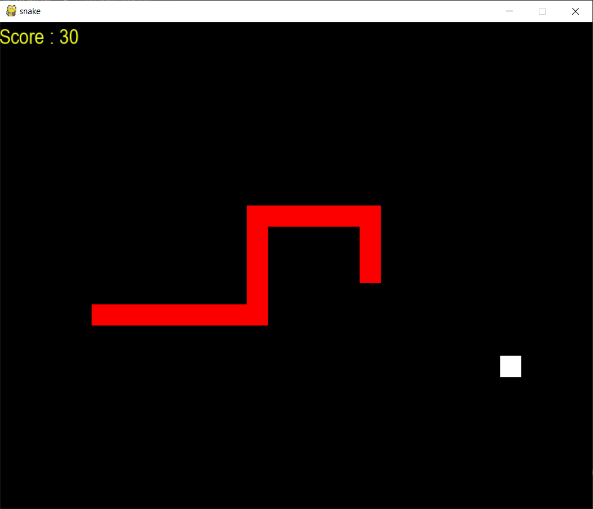
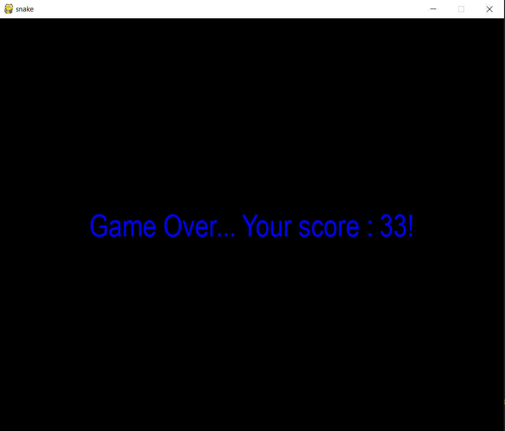

# Snake game in Python

A Snake game coded in Python. I used the library Pygame.

#### Contains :
- A score display system 
- Possibility to pause and resume the game
- Restart the game without relaunching the script

#### Game images :

